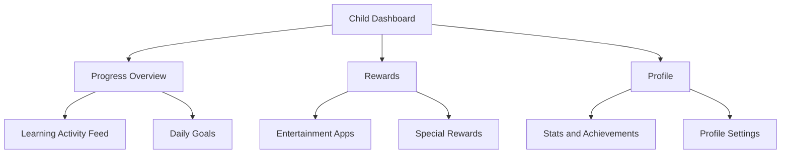
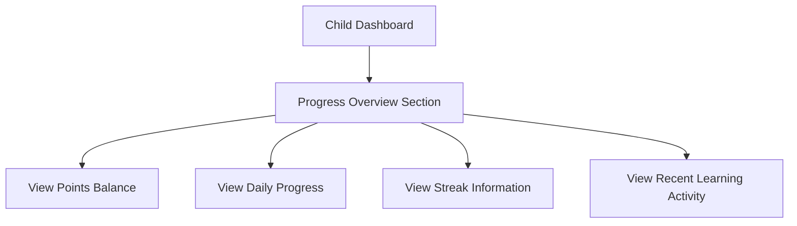
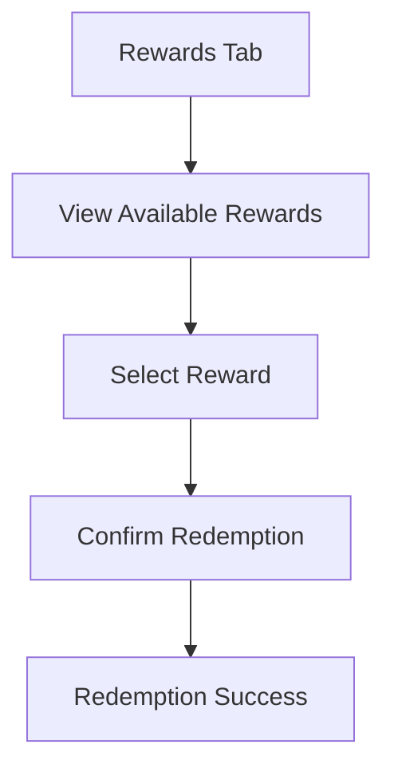
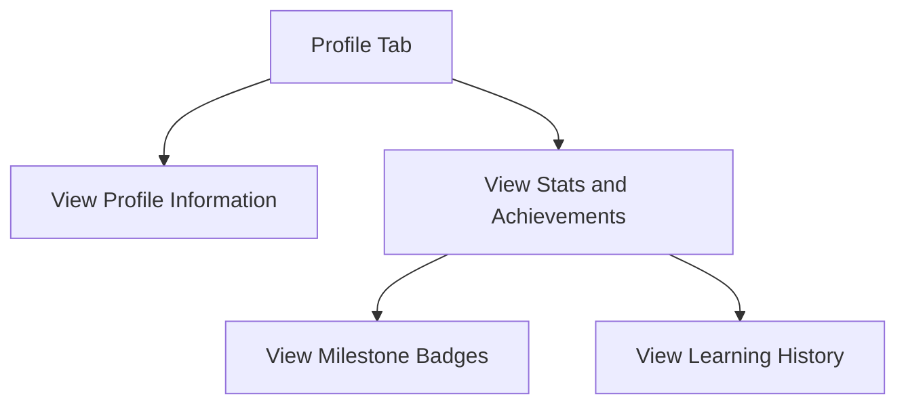

# Screen Time Rewards Child Dashboard UI/UX Specification

This document defines the user experience goals, information architecture, user flows, and visual design specifications for Screen Time Rewards' Child Dashboard. It serves as the foundation for visual design and frontend development, ensuring a cohesive and user-centered experience.

## Change Log

| Date | Version | Description | Author |
|------|---------|-------------|--------|
| 2025-10-03 | 1.0 | Initial document creation | Sally (UX Expert) |

## 1. Introduction

### 1.1 Overall UX Goals & Principles

#### Target User Personas

Based on the project description, we have identified the following key user persona for the Child Dashboard:

**Child User:**
- Engages with various apps and digital content
- Motivated by rewards and positive reinforcement
- May have limited technical understanding
- Needs clear guidance on what activities earn rewards
- Short attention span, requires engaging experience
- Wants to see their progress and achievements
- Interested in redeeming earned points for rewards

#### Usability Goals

1. **Immediate Feedback:** Children see points earned immediately after learning activities
2. **Clear Progress:** Children understand how close they are to goals and rewards
3. **Easy Redemption:** Children can easily redeem points for rewards
4. **Engaging Experience:** Interface is fun and motivating for children
5. **Simple Navigation:** Children can access all features without confusion

#### Design Principles

1. **Fun and Engaging** - Use playful elements and positive reinforcement
2. **Progress Visualization** - Show progress with clear, visual indicators
3. **Consistent Patterns** - Use familiar UI patterns throughout the application
4. **Immediate Feedback** - Every action should have a clear, immediate response
5. **Accessible by Default** - Design for all users from the start
6. **Reward-Focused** - Emphasize earning and redeeming rewards

## 2. Information Architecture (IA)

### 2.1 Site Map / Screen Inventory

### 2.2 Navigation Structure

**Primary Navigation:** Tab-based navigation with Dashboard, Rewards, and Profile tabs

**Secondary Navigation:** Contextual actions within each section (e.g., redeem rewards, view achievements)

**Breadcrumb Strategy:** Simple back navigation with clear section titles

## 3. User Flows

### 3.1 Viewing Progress Overview

**User Goal:** Child wants to see their current points, streak, and progress toward goals

**Entry Points:** Child Dashboard tab

**Success Criteria:** Child can quickly understand their current status and what they need to do to earn more points

**Edge Cases & Error Handling:**
- No recent activity to display
- Network connectivity issues
- Data sync delays

**Notes:** Should use visual elements like progress rings and badges to make progress clear

### 3.2 Redeeming Rewards

**User Goal:** Child wants to spend their earned points on entertainment apps or special rewards

**Entry Points:** Rewards tab

**Success Criteria:** Child can easily find rewards they can afford and successfully redeem them

**Edge Cases & Error Handling:**
- Insufficient points for selected reward
- Reward already unlocked
- Network connectivity issues
- Parental approval required

**Notes:** Should provide clear feedback about point costs and redemption status

### 3.3 Viewing Profile and Achievements

**User Goal:** Child wants to see their stats, achievements, and profile information

**Entry Points:** Profile tab

**Success Criteria:** Child can see their accomplishments and understand their progress over time

**Edge Cases & Error Handling:**
- No achievements to display
- Data sync issues
- Privacy settings limiting visibility

**Notes:** Should celebrate achievements with visual elements and positive messaging

## 4. Wireframes & Mockups

### 4.1 Design Files

**Primary Design Files:** Figma files to be created for each key screen

### 4.2 Key Screen Layouts

#### Child Dashboard Screen

**Purpose:** Central hub for children to see their progress and recent activity

**Key Elements:**
- Points balance with visual indicator
- Daily progress visualization (rings or bars)
- Streak information with visual rewards
- Recent learning activity feed
- Quick access to rewards

**Interaction Notes:** Should provide immediate feedback for point earning, use playful animations

**Design File Reference:** [To be created in Figma]

#### Rewards Screen

**Purpose:** Interface for children to view and redeem rewards with their earned points

**Key Elements:**
- Current points balance prominently displayed
- Entertainment apps with point costs and unlock status
- Special rewards with descriptions and costs
- Recent redemptions history
- Subscription status indicator

**Interaction Notes:** Should make it clear what rewards are affordable, provide celebration for redemptions

**Design File Reference:** [To be created in Figma]

## 5. Component Library / Design System

### 5.1 Design System Approach

**Design System Approach:** Custom design system based on Apple's Human Interface Guidelines with custom branding for Screen Time Rewards, extending the existing design system with child-friendly elements

### 5.2 Core Components

#### ProgressDashboard Component

**Purpose:** Display child's progress with visual indicators for daily and weekly goals

**Variants:** Daily progress ring, weekly progress bar, streak counter

**States:** Default, goal achieved, milestone reached

**Usage Guidelines:** Use colorful, engaging visuals, include clear labels, show progress toward goals

#### LearningActivityRow Component

**Purpose:** Display recent learning activities in a timeline format

**Variants:** App-specific, general learning, milestone achievement

**States:** Default

**Usage Guidelines:** Use app-specific icons, show point earnings clearly, include timestamps

#### EntertainmentAppUnlockCard Component

**Purpose:** Display entertainment apps that can be unlocked with earned points

**Variants:** Affordable, unaffordable, unlocked, locked

**States:** Default, unlocking, unlocked

**Usage Guidelines:** Show point costs clearly, use app icons, provide unlock duration options

## 6. Branding & Style Guide

### 6.1 Visual Identity

**Brand Guidelines:** Family-friendly, positive reinforcement focused brand with emphasis on growth and achievement, consistent with existing app branding but with more playful elements for children

### 6.2 Color Palette

| Color Type | Hex Code | Usage |
|------------|----------|-------|
| Primary | #4A90E2 | Main actions, navigation, learning elements |
| Secondary | #50C878 | Success states, positive actions, reward elements |
| Accent | #FFD700 | Rewards, highlights, points |
| Success | #32CD32 | Confirmation messages |
| Warning | #FFA500 | Caution messages |
| Error | #FF6347 | Error states, destructive actions |
| Neutral | #F5F5F5, #333333 | Backgrounds, text |
| Fun | #FF69B4, #9370DB | Playful elements, achievements |

### 6.3 Typography

#### Font Families
- **Primary:** SF Pro (system font for iOS)
- **Secondary:** SF Pro Rounded (for child-friendly elements)
- **Monospace:** SF Mono (for technical information)

#### Type Scale

| Element | Size | Weight | Line Height |
|---------|------|--------|-------------|
| H1 | 28px | Bold | 34px |
| H2 | 22px | SemiBold | 28px |
| H3 | 18px | Medium | 24px |
| Body | 16px | Regular | 22px |
| Small | 14px | Regular | 20px |

### 6.4 Iconography

**Icon Library:** SF Symbols (system icons for iOS) with additional playful icons for achievements

**Usage Guidelines:** Use filled variants for active states, outlined for inactive; maintain consistent sizing; use child-friendly icons

### 6.5 Spacing & Layout

**Grid System:** 8px base grid system

**Spacing Scale:** 4px, 8px, 16px, 24px, 32px, 48px, 64px

## 7. Accessibility Requirements

### 7.1 Compliance Target

**Standard:** WCAG 2.1 AA with additional considerations for children's apps

### 7.2 Key Requirements

**Visual:**
- Color contrast ratios: Minimum 4.5:1 for normal text, 3:1 for large text
- Focus indicators: Visible focus rings for all interactive elements
- Text sizing: Support for Dynamic Type with 7 text size options

**Interaction:**
- Keyboard navigation: Full keyboard access to all functionality
- Screen reader support: Proper labeling and descriptions for VoiceOver
- Touch targets: Minimum 44x44 points for interactive elements

**Content:**
- Alternative text: Descriptive alt text for all informative images
- Heading structure: Logical heading hierarchy for screen reader navigation
- Form labels: Clear, associated labels for all form controls

### 7.3 Testing Strategy

Regular testing with VoiceOver, Dynamic Type, and Accessibility Inspector. Include children with disabilities in usability testing when possible.

## 8. Responsiveness Strategy

### 8.1 Breakpoints

| Breakpoint | Min Width | Max Width | Target Devices |
|------------|-----------|-----------|----------------|
| Mobile | 320px | 767px | iPhones |
| Tablet | 768px | 1023px | iPads |
| Desktop | 1024px | - | iPad Pro (landscape) |

### 8.2 Adaptation Patterns

**Layout Changes:** Single column on mobile, multi-column on tablet/desktop

**Navigation Changes:** Tab bar on mobile, sidebar navigation on tablet/desktop

**Content Priority:** Core functionality always visible, secondary actions in menus on smaller screens

**Interaction Changes:** Touch gestures on mobile, keyboard shortcuts on larger screens

## 9. Animation & Micro-interactions

### 9.1 Motion Principles

Animations should be playful but not distracting, with durations between 200-500ms. Use standard iOS easing curves.

### 9.2 Key Animations

- **Point Earning Animation:** Visual feedback when points are earned (Duration: 300ms, Easing: easeOut)
- **Reward Redemption Animation:** Celebration animation when reward is redeemed (Duration: 500ms, Easing: easeInOut)
- **Progress Update Animation:** Smooth transitions when progress changes (Duration: 400ms, Easing: easeOut)
- **Navigation Transition:** Smooth transitions between screens (Duration: 300ms, Easing: easeInOut)

## 10. Performance Considerations

### 10.1 Performance Goals

- **Page Load:** <1 second for dashboard views
- **Interaction Response:** <100ms for UI interactions
- **Animation FPS:** Maintain 60fps for all animations

### 10.2 Design Strategies

- Optimize image assets for different screen densities
- Limit simultaneous animations
- Use efficient layouts that minimize redraws
- Implement proper loading states for network-dependent features

## 11. Next Steps

### 11.1 Immediate Actions

1. Review this specification with the development team
2. Create detailed visual designs in Figma for key screens
3. Develop a component library based on these specifications
4. Conduct usability testing with child users

### 11.2 Design Handoff Checklist

- [x] All user flows documented
- [x] Component inventory complete
- [x] Accessibility requirements defined
- [x] Responsive strategy clear
- [x] Brand guidelines incorporated
- [x] Performance goals established