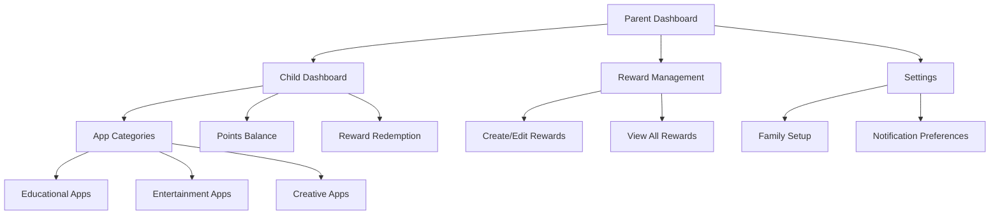
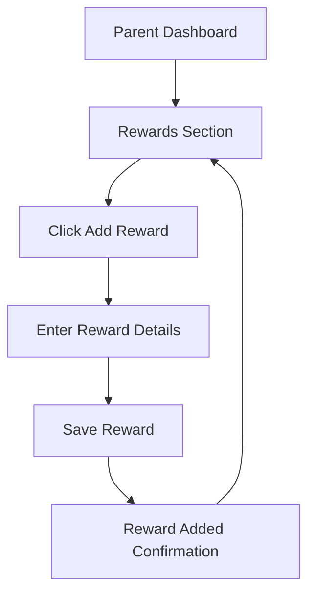
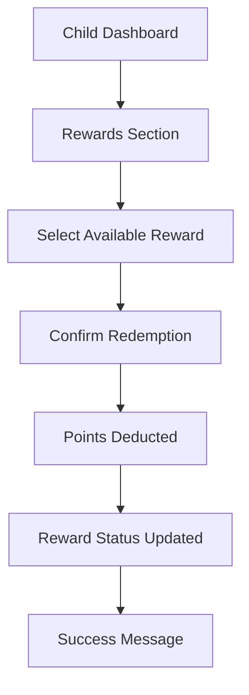

# Screen Time Rewards UI/UX Specification

This document defines the user experience goals, information architecture, user flows, and visual design specifications for Screen Time Rewards' user interface. It serves as the foundation for visual design and frontend development, ensuring a cohesive and user-centered experience.

## Change Log

| Date | Version | Description | Author |
|------|---------|-------------|--------|
| 2025-10-03 | 1.0 | Initial document creation | Sally (UX Expert) |

## 1. Introduction

### 1.1 Overall UX Goals & Principles

#### Target User Personas

Based on the project description, we have identified the following key user personas:

1. **Parent User:**
   - Primary decision-maker for family screen time policies
   - Interested in promoting healthy screen time habits
   - Needs tools to monitor and guide children's device usage
   - Values educational and productive screen time activities

2. **Child User:**
   - Engages with various apps and digital content
   - Motivated by rewards and positive reinforcement
   - May have limited technical understanding
   - Needs clear guidance on what activities earn rewards

#### Usability Goals

1. **Ease of Learning:** New users (parents) can set up basic reward systems within 10 minutes
2. **Efficiency:** Parents can quickly check child progress and adjust settings
3. **Error Prevention:** Clear validation for reward redemption and system changes
4. **Motivation:** Children can easily understand how to earn and redeem rewards
5. **Transparency:** Both parents and children can clearly see point balances and earned rewards

#### Design Principles

1. **Clarity over cleverness** - Prioritize clear communication over aesthetic innovation
2. **Progressive disclosure** - Show only what's needed, when it's needed
3. **Consistent patterns** - Use familiar UI patterns throughout the application
4. **Immediate feedback** - Every action should have a clear, immediate response
5. **Accessible by default** - Design for all users from the start

## 2. Information Architecture (IA)

### 2.1 Site Map / Screen Inventory

### 2.2 Navigation Structure

**Primary Navigation:** Tab-based navigation for Parent Dashboard with sections for Child Overview, Rewards, and Settings

**Secondary Navigation:** Contextual actions within each section (e.g., add reward, edit settings)

**Breadcrumb Strategy:** Simple back navigation with clear section titles

## 3. User Flows

### 3.1 Setting Up a New Reward

**User Goal:** Parent wants to create a new reward that their child can redeem with earned points

**Entry Points:** Parent Dashboard > Rewards section > "Add Reward" button

**Success Criteria:** New reward is saved and visible in the child's reward redemption view

**Edge Cases & Error Handling:**
- Invalid point values (negative numbers, non-numeric input)
- Missing reward name or description
- Duplicate reward names

**Notes:** Points required should have reasonable validation to prevent accidental very high or low values

### 3.2 Child Redeeming a Reward

**User Goal:** Child wants to redeem earned points for a reward

**Entry Points:** Child Dashboard > Rewards section > "Redeem" button on available reward

**Success Criteria:** Points are deducted from child's balance and reward status is updated

**Edge Cases & Error Handling:**
- Insufficient points for redemption
- Reward no longer available
- Network connectivity issues during redemption

**Notes:** Should include confirmation step to prevent accidental redemptions

## 4. Wireframes & Mockups

### 4.1 Design Files

**Primary Design Files:** Figma files to be created for each key screen

### 4.2 Key Screen Layouts

#### Parent Dashboard Screen

**Purpose:** Central hub for parents to monitor and manage their child's screen time rewards

**Key Elements:**
- Child profile header with name and avatar
- Points summary (earned, redeemed, available)
- Quick access to reward management
- Recent activity feed
- Navigation to detailed settings

**Interaction Notes:** Points summary should update in real-time when possible

**Design File Reference:** [To be created in Figma]

#### Child Dashboard Screen

**Purpose:** Simple interface for children to see their progress and available rewards

**Key Elements:**
- Fun visual representation of points balance
- List of available rewards with point costs
- "Redeem" buttons for each reward
- Progress toward next reward milestone
- Simple navigation

**Interaction Notes:** Should use age-appropriate language and visual elements

**Design File Reference:** [To be created in Figma]

## 5. Component Library / Design System

### 5.1 Design System Approach

**Design System Approach:** Custom design system based on Apple's Human Interface Guidelines with custom branding for Screen Time Rewards

### 5.2 Core Components

#### Points Display Component

**Purpose:** Consistently display point balances throughout the app

**Variants:** Large display for dashboards, small badge for lists

**States:** Default, loading, error

**Usage Guidelines:** Always use consistent formatting for point values, include visual indicator for point changes

#### Reward Card Component

**Purpose:** Display individual rewards in a consistent, scannable format

**Variants:** Available for redemption, already redeemed, locked (insufficient points)

**States:** Default, hover, selected, disabled

**Usage Guidelines:** Include clear point cost, visual indicator of reward status, and prominent call-to-action

## 6. Branding & Style Guide

### 6.1 Visual Identity

**Brand Guidelines:** Family-friendly, positive reinforcement focused brand with emphasis on growth and achievement

### 6.2 Color Palette

| Color Type | Hex Code | Usage |
|------------|----------|-------|
| Primary | #4A90E2 | Main actions, navigation |
| Secondary | #50C878 | Success states, positive actions |
| Accent | #FFD700 | Rewards, highlights |
| Success | #32CD32 | Confirmation messages |
| Warning | #FFA500 | Caution messages |
| Error | #FF6347 | Error states, destructive actions |
| Neutral | #F5F5F5, #333333 | Backgrounds, text |

### 6.3 Typography

#### Font Families
- **Primary:** SF Pro (system font for iOS)
- **Secondary:** SF Pro Rounded (for child-friendly elements)
- **Monospace:** SF Mono (for technical information)

#### Type Scale

| Element | Size | Weight | Line Height |
|---------|------|--------|-------------|
| H1 | 28px | Bold | 34px |
| H2 | 22px | SemiBold | 28px |
| H3 | 18px | Medium | 24px |
| Body | 16px | Regular | 22px |
| Small | 14px | Regular | 20px |

### 6.4 Iconography

**Icon Library:** SF Symbols (system icons for iOS)

**Usage Guidelines:** Use filled variants for active states, outlined for inactive; maintain consistent sizing

### 6.5 Spacing & Layout

**Grid System:** 8px base grid system

**Spacing Scale:** 4px, 8px, 16px, 24px, 32px, 48px, 64px

## 7. Accessibility Requirements

### 7.1 Compliance Target

**Standard:** WCAG 2.1 AA with additional considerations for children's apps

### 7.2 Key Requirements

**Visual:**
- Color contrast ratios: Minimum 4.5:1 for normal text, 3:1 for large text
- Focus indicators: Visible focus rings for all interactive elements
- Text sizing: Support for Dynamic Type with 7 text size options

**Interaction:**
- Keyboard navigation: Full keyboard access to all functionality
- Screen reader support: Proper labeling and descriptions for VoiceOver
- Touch targets: Minimum 44x44 points for interactive elements

**Content:**
- Alternative text: Descriptive alt text for all informative images
- Heading structure: Logical heading hierarchy for screen reader navigation
- Form labels: Clear, associated labels for all form controls

### 7.3 Testing Strategy

Regular testing with VoiceOver, Dynamic Type, and Accessibility Inspector. Include users with disabilities in usability testing when possible.

## 8. Responsiveness Strategy

### 8.1 Breakpoints

| Breakpoint | Min Width | Max Width | Target Devices |
|------------|-----------|-----------|----------------|
| Mobile | 320px | 767px | iPhones |
| Tablet | 768px | 1023px | iPads |
| Desktop | 1024px | - | iPad Pro (landscape) |

### 8.2 Adaptation Patterns

**Layout Changes:** Single column on mobile, multi-column on tablet/desktop

**Navigation Changes:** Tab bar on mobile, sidebar navigation on tablet/desktop

**Content Priority:** Core functionality always visible, secondary actions in menus on smaller screens

**Interaction Changes:** Touch gestures on mobile, keyboard shortcuts on larger screens

## 9. Animation & Micro-interactions

### 9.1 Motion Principles

Animations should be playful but not distracting, with durations between 200-500ms. Use standard iOS easing curves.

### 9.2 Key Animations

- **Point Earning Animation:** Visual feedback when points are earned (Duration: 300ms, Easing: easeOut)
- **Reward Redemption Animation:** Celebration animation when reward is redeemed (Duration: 500ms, Easing: easeInOut)
- **Navigation Transition:** Smooth transitions between screens (Duration: 300ms, Easing: easeInOut)

## 10. Performance Considerations

### 10.1 Performance Goals

- **Page Load:** <2 seconds for dashboard views
- **Interaction Response:** <100ms for UI interactions
- **Animation FPS:** Maintain 60fps for all animations

### 10.2 Design Strategies

- Optimize image assets for different screen densities
- Limit simultaneous animations
- Use efficient layouts that minimize redraws
- Implement proper loading states for network-dependent features

## 11. Next Steps

### 11.1 Immediate Actions

1. Review this specification with the development team
2. Create detailed visual designs in Figma for key screens
3. Develop a component library based on these specifications
4. Conduct usability testing with parent and child users

### 11.2 Design Handoff Checklist

- [x] All user flows documented
- [x] Component inventory complete
- [x] Accessibility requirements defined
- [x] Responsive strategy clear
- [x] Brand guidelines incorporated
- [x] Performance goals established