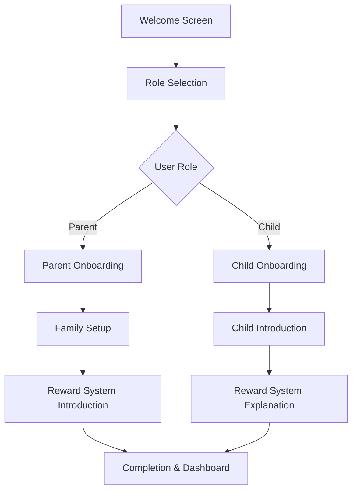
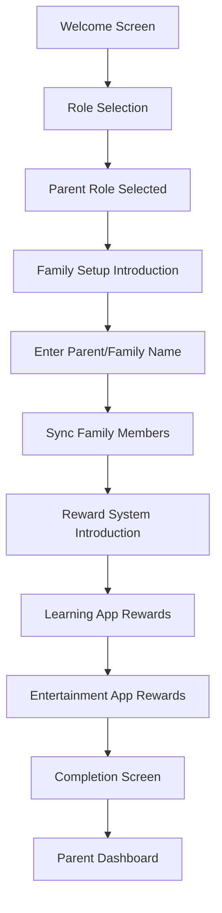
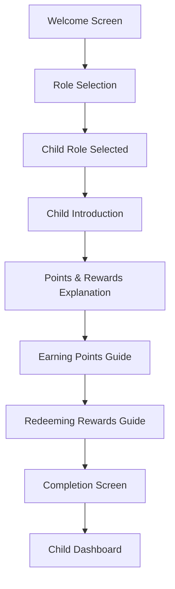

# Screen Time Rewards Onboarding Flow UI/UX Specification

This document defines the user experience goals, information architecture, user flows, and visual design specifications for Screen Time Rewards' onboarding flow. It serves as the foundation for visual design and frontend development, ensuring a cohesive and user-centered experience.

## Change Log

| Date | Version | Description | Author |
|------|---------|-------------|--------|
| 2025-10-03 | 1.0 | Initial document creation | Sally (UX Expert) |

## 1. Introduction

### 1.1 Overall UX Goals & Principles

#### Target User Personas

Based on the project description, we have identified the following key user personas for the onboarding flow:

1. **Parent User:**
   - Primary decision-maker for family screen time policies
   - Interested in promoting healthy screen time habits
   - Needs tools to monitor and guide children's device usage
   - Values educational and productive screen time activities
   - May be tech-savvy or not, requires clear guidance

2. **Child User:**
   - Engages with various apps and digital content
   - Motivated by rewards and positive reinforcement
   - May have limited technical understanding
   - Needs clear guidance on what activities earn rewards
   - Short attention span, requires engaging experience

#### Usability Goals

1. **Ease of Learning:** New users can complete onboarding within 3 minutes
2. **Clarity:** Users understand the app's value proposition and how it works
3. **Engagement:** Onboarding is engaging and not a barrier to using the app
4. **Personalization:** Onboarding adapts to user role (parent vs child)
5. **Progressive Disclosure:** Information is revealed gradually to avoid overwhelming users

#### Design Principles

1. **Clarity over cleverness** - Prioritize clear communication over aesthetic innovation
2. **Progressive disclosure** - Show only what's needed, when it's needed
3. **Consistent patterns** - Use familiar UI patterns throughout the application
4. **Immediate feedback** - Every action should have a clear, immediate response
5. **Accessible by default** - Design for all users from the start
6. **Fun and engaging** - Especially for child users, make the experience enjoyable

## 2. Information Architecture (IA)

### 2.1 Site Map / Screen Inventory

### 2.2 Navigation Structure

**Primary Navigation:** Linear progression through onboarding steps with optional skip

**Secondary Navigation:** Back button to previous steps, skip option to bypass onboarding

**Breadcrumb Strategy:** Progress indicator showing current step and total steps

## 3. User Flows

### 3.1 Parent Onboarding Flow

**User Goal:** Parent wants to understand how to set up and use Screen Time Rewards for their family

**Entry Points:** First app launch after installation

**Success Criteria:** Parent completes onboarding and understands how to set up family members and configure rewards

**Edge Cases & Error Handling:**
- No family members found during sync
- Family Sharing not enabled on device
- Network connectivity issues during sync
- User skips family setup

**Notes:** Should provide clear guidance for enabling Family Sharing if not already set up

### 3.2 Child Onboarding Flow

**User Goal:** Child wants to understand how to earn and redeem rewards with Screen Time Rewards

**Entry Points:** First app launch after installation

**Success Criteria:** Child completes onboarding and understands how to earn points and redeem rewards

**Edge Cases & Error Handling:**
- Child doesn't understand concepts
- Child wants to switch to parent role
- App not installed on parent's device

**Notes:** Should use age-appropriate language and visual elements

## 4. Wireframes & Mockups

### 4.1 Design Files

**Primary Design Files:** Figma files to be created for each key screen

### 4.2 Key Screen Layouts

#### Welcome Screen

**Purpose:** Introduce the app and its value proposition to new users

**Key Elements:**
- App logo or illustrative icon
- Engaging headline: "Transform Screen Time into Learning Time"
- Brief description of the app's benefits
- Get Started button

**Interaction Notes:** Should immediately capture attention and communicate value

**Design File Reference:** [To be created in Figma]

#### Role Selection Screen

**Purpose:** Allow users to select their role (parent or child) to customize onboarding

**Key Elements:**
- Clear visual distinction between parent and child options
- Brief description of each role
- Large, tappable buttons for each role
- Skip onboarding option

**Interaction Notes:** Should make it obvious which role to select with clear visual cues

**Design File Reference:** [To be created in Figma]

#### Parent Family Setup Screen

**Purpose:** Guide parents through setting up their family for Screen Time Rewards

**Key Elements:**
- Progress indicator (Step 1 of 3)
- Clear instructions for Family Sharing setup
- Fields for parent and family name
- Visual guide for enabling Family Sharing
- Continue and Back buttons

**Interaction Notes:** Should provide clear guidance without being overwhelming

**Design File Reference:** [To be created in Figma]

#### Child Introduction Screen

**Purpose:** Introduce children to the concept of earning rewards for learning

**Key Elements:**
- Fun, colorful visual elements
- Simple explanation: "Learn and Earn Rewards!"
- Points visualization
- Friendly character or mascot
- Continue button

**Interaction Notes:** Should be engaging and use simple language appropriate for children

**Design File Reference:** [To be created in Figma]

## 5. Component Library / Design System

### 5.1 Design System Approach

**Design System Approach:** Custom design system based on Apple's Human Interface Guidelines with custom branding for Screen Time Rewards, extending the existing design system

### 5.2 Core Components

#### Progress Indicator Component

**Purpose:** Show users their progress through the onboarding flow

**Variants:** Linear progress bar, step counter, circular progress

**States:** Default, completed step, current step

**Usage Guidelines:** Place at the top of each onboarding screen, use consistent styling

#### Role Selection Card Component

**Purpose:** Present role options (parent/child) in an appealing, clear way

**Variants:** Parent card, child card

**States:** Default, selected, disabled

**Usage Guidelines:** Use large tap targets, include clear icons and descriptions

#### Onboarding Benefit Component

**Purpose:** Highlight key benefits of the app in an engaging way

**Variants:** Icon with text, illustration with text

**States:** Default

**Usage Guidelines:** Use consistent styling, include relevant icons or illustrations

## 6. Branding & Style Guide

### 6.1 Visual Identity

**Brand Guidelines:** Family-friendly, positive reinforcement focused brand with emphasis on growth and achievement, consistent with existing app branding

### 6.2 Color Palette

| Color Type | Hex Code | Usage |
|------------|----------|-------|
| Primary | #4A90E2 | Main actions, navigation, parent elements |
| Secondary | #50C878 | Success states, positive actions, child elements |
| Accent | #FFD700 | Rewards, highlights, points |
| Success | #32CD32 | Confirmation messages |
| Warning | #FFA500 | Caution messages |
| Error | #FF6347 | Error states, destructive actions |
| Neutral | #F5F5F5, #333333 | Backgrounds, text |

### 6.3 Typography

#### Font Families
- **Primary:** SF Pro (system font for iOS)
- **Secondary:** SF Pro Rounded (for child-friendly elements)
- **Monospace:** SF Mono (for technical information)

#### Type Scale

| Element | Size | Weight | Line Height |
|---------|------|--------|-------------|
| H1 | 28px | Bold | 34px |
| H2 | 22px | SemiBold | 28px |
| H3 | 18px | Medium | 24px |
| Body | 16px | Regular | 22px |
| Small | 14px | Regular | 20px |

### 6.4 Iconography

**Icon Library:** SF Symbols (system icons for iOS)

**Usage Guidelines:** Use filled variants for active states, outlined for inactive; maintain consistent sizing; use child-friendly icons for child onboarding

### 6.5 Spacing & Layout

**Grid System:** 8px base grid system

**Spacing Scale:** 4px, 8px, 16px, 24px, 32px, 48px, 64px

## 7. Accessibility Requirements

### 7.1 Compliance Target

**Standard:** WCAG 2.1 AA with additional considerations for children's apps

### 7.2 Key Requirements

**Visual:**
- Color contrast ratios: Minimum 4.5:1 for normal text, 3:1 for large text
- Focus indicators: Visible focus rings for all interactive elements
- Text sizing: Support for Dynamic Type with 7 text size options

**Interaction:**
- Keyboard navigation: Full keyboard access to all functionality
- Screen reader support: Proper labeling and descriptions for VoiceOver
- Touch targets: Minimum 44x44 points for interactive elements

**Content:**
- Alternative text: Descriptive alt text for all informative images
- Heading structure: Logical heading hierarchy for screen reader navigation
- Form labels: Clear, associated labels for all form controls

### 7.3 Testing Strategy

Regular testing with VoiceOver, Dynamic Type, and Accessibility Inspector. Include users with disabilities in usability testing when possible.

## 8. Responsiveness Strategy

### 8.1 Breakpoints

| Breakpoint | Min Width | Max Width | Target Devices |
|------------|-----------|-----------|----------------|
| Mobile | 320px | 767px | iPhones |
| Tablet | 768px | 1023px | iPads |
| Desktop | 1024px | - | iPad Pro (landscape) |

### 8.2 Adaptation Patterns

**Layout Changes:** Single column on mobile, multi-column on tablet/desktop

**Navigation Changes:** Tab bar on mobile, sidebar navigation on tablet/desktop

**Content Priority:** Core functionality always visible, secondary actions in menus on smaller screens

**Interaction Changes:** Touch gestures on mobile, keyboard shortcuts on larger screens

## 9. Animation & Micro-interactions

### 9.1 Motion Principles

Animations should be playful but not distracting, with durations between 200-500ms. Use standard iOS easing curves.

### 9.2 Key Animations

- **Transition Animation:** Smooth transitions between onboarding screens (Duration: 300ms, Easing: easeInOut)
- **Button Feedback:** Subtle feedback when buttons are tapped (Duration: 150ms, Easing: easeOut)
- **Progress Animation:** Visual feedback when progress is made (Duration: 400ms, Easing: easeOut)
- **Completion Celebration:** Fun animation when onboarding is completed (Duration: 600ms, Easing: easeInOut)

## 10. Performance Considerations

### 10.1 Performance Goals

- **Page Load:** <1 second for each onboarding screen
- **Interaction Response:** <100ms for UI interactions
- **Animation FPS:** Maintain 60fps for all animations

### 10.2 Design Strategies

- Optimize image assets for different screen densities
- Limit simultaneous animations
- Use efficient layouts that minimize redraws
- Implement proper loading states for network-dependent features

## 11. Next Steps

### 11.1 Immediate Actions

1. Review this specification with the development team
2. Create detailed visual designs in Figma for key screens
3. Develop a component library based on these specifications
4. Conduct usability testing with parent and child users

### 11.2 Design Handoff Checklist

- [x] All user flows documented
- [x] Component inventory complete
- [x] Accessibility requirements defined
- [x] Responsive strategy clear
- [x] Brand guidelines incorporated
- [x] Performance goals established