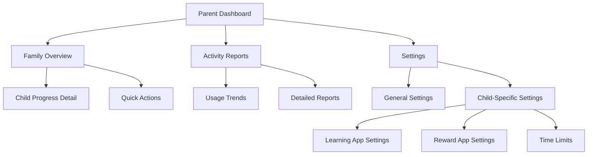
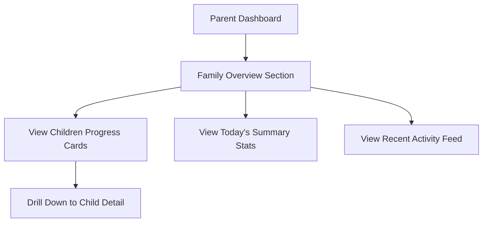
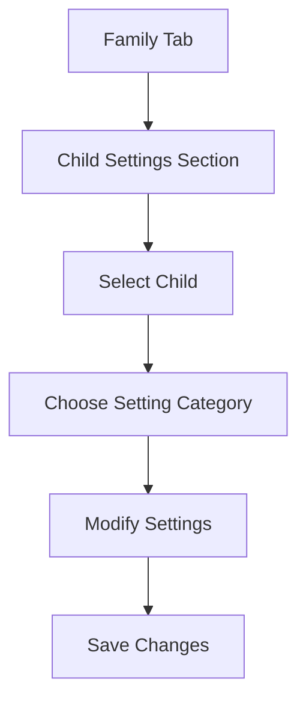
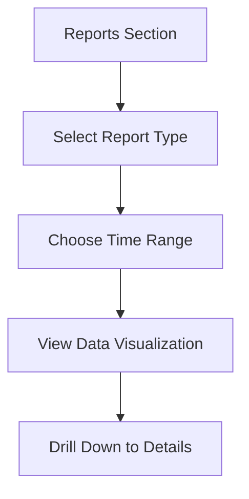

# Screen Time Rewards Parent Dashboard UI/UX Specification

This document defines the user experience goals, information architecture, user flows, and visual design specifications for Screen Time Rewards' Parent Dashboard. It serves as the foundation for visual design and frontend development, ensuring a cohesive and user-centered experience.

## Change Log

| Date | Version | Description | Author |
|------|---------|-------------|--------|
| 2025-10-03 | 1.0 | Initial document creation | Sally (UX Expert) |

## 1. Introduction

### 1.1 Overall UX Goals & Principles

#### Target User Personas

Based on the project description, we have identified the following key user persona for the Parent Dashboard:

**Parent User:**
- Primary decision-maker for family screen time policies
- Interested in promoting healthy screen time habits
- Needs tools to monitor and guide children's device usage
- Values educational and productive screen time activities
- May be tech-savvy or not, requires clear guidance
- Wants to see quick insights into family progress
- Needs to configure and adjust settings efficiently

#### Usability Goals

1. **Quick Overview:** Parents can see family progress at a glance within 5 seconds
2. **Easy Configuration:** Parents can adjust settings for individual children quickly
3. **Clear Insights:** Parents can understand their children's usage patterns
4. **Actionable Information:** Parents can identify issues and take corrective actions
5. **Efficient Navigation:** Parents can access all features without excessive clicking

#### Design Principles

1. **Data Visualization First** - Prioritize clear, actionable data visualizations
2. **Progressive Disclosure** - Show summary information first, details on demand
3. **Consistent Patterns** - Use familiar UI patterns throughout the application
4. **Immediate Feedback** - Every action should have a clear, immediate response
5. **Accessible by Default** - Design for all users from the start
6. **Parental Control Focus** - Emphasize tools for managing and guiding children

## 2. Information Architecture (IA)

### 2.1 Site Map / Screen Inventory

### 2.2 Navigation Structure

**Primary Navigation:** Tab-based navigation with Dashboard, Family, and Settings tabs

**Secondary Navigation:** Contextual actions within each section (e.g., configure settings, view reports)

**Breadcrumb Strategy:** Simple back navigation with clear section titles

## 3. User Flows

### 3.1 Viewing Family Overview

**User Goal:** Parent wants to quickly see how their family is doing with ScreenTime Rewards

**Entry Points:** Parent Dashboard tab

**Success Criteria:** Parent can see all children's progress, identify active users, and understand overall family metrics

**Edge Cases & Error Handling:**
- No children found in Family Sharing
- Family Sharing not properly configured
- Data sync issues
- Child with no activity

**Notes:** Should prioritize most important information at the top with clear visual hierarchy

### 3.2 Configuring Child Settings

**User Goal:** Parent wants to adjust settings for a specific child

**Entry Points:** Family tab > Child-specific settings section

**Success Criteria:** Parent can easily find and modify settings for individual children

**Edge Cases & Error Handling:**
- Invalid setting values
- Conflicting settings
- Network connectivity issues
- Child device not properly configured

**Notes:** Should provide clear guidance on what each setting does and its impact

### 3.3 Reviewing Activity Reports

**User Goal:** Parent wants to understand their children's usage patterns over time

**Entry Points:** Dashboard or Family tab > Reports section

**Success Criteria:** Parent can identify trends, compare usage, and make informed decisions

**Edge Cases & Error Handling:**
- Insufficient data for selected time range
- Data visualization rendering issues
- Export functionality failures

**Notes:** Should provide multiple visualization options (charts, tables, summaries)

## 4. Wireframes & Mockups

### 4.1 Design Files

**Primary Design Files:** Figma files to be created for each key screen

### 4.2 Key Screen Layouts

#### Parent Dashboard Screen

**Purpose:** Central hub for parents to monitor family progress and access key features

**Key Elements:**
- Family statistics header with key metrics
- Children progress cards with visual indicators
- Recent activity feed with timestamps
- Quick action buttons for common tasks
- Subscription status indicator

**Interaction Notes:** Should update in real-time when possible, provide clear drill-down paths

**Design File Reference:** [To be created in Figma]

#### Child Progress Detail Screen

**Purpose:** Detailed view of a specific child's progress and settings

**Key Elements:**
- Child profile header with avatar and name
- Detailed progress metrics (points, streaks, learning time)
- Settings quick access
- Recent activity timeline
- Weekly/monthly progress charts

**Interaction Notes:** Should allow quick access to child-specific settings, provide export options

**Design File Reference:** [To be created in Figma]

## 5. Component Library / Design System

### 5.1 Design System Approach

**Design System Approach:** Custom design system based on Apple's Human Interface Guidelines with custom branding for Screen Time Rewards, extending the existing design system

### 5.2 Core Components

#### OverviewStatCard Component

**Purpose:** Display key family statistics in a consistent, scannable format

**Variants:** Children count, total points, active today

**States:** Default, loading, error

**Usage Guidelines:** Include clear icons, use consistent color coding, show trends when available

#### ChildProgressCard Component

**Purpose:** Display individual child progress in a consistent format

**Variants:** Default, selected, inactive

**States:** Default, loading, error

**Usage Guidelines:** Include visual progress indicators, clear point balances, quick access to settings

#### RecentActivityRow Component

**Purpose:** Display recent family activity in a timeline format

**Variants:** Learning activity, reward redemption, milestone achievement

**States:** Default

**Usage Guidelines:** Use color coding for activity types, include timestamps, show point changes

## 6. Branding & Style Guide

### 6.1 Visual Identity

**Brand Guidelines:** Family-friendly, positive reinforcement focused brand with emphasis on growth and achievement, consistent with existing app branding

### 6.2 Color Palette

| Color Type | Hex Code | Usage |
|------------|----------|-------|
| Primary | #4A90E2 | Main actions, navigation, parent elements |
| Secondary | #50C878 | Success states, positive actions |
| Accent | #FFD700 | Rewards, highlights, points |
| Success | #32CD32 | Confirmation messages |
| Warning | #FFA500 | Caution messages |
| Error | #FF6347 | Error states, destructive actions |
| Neutral | #F5F5F5, #333333 | Backgrounds, text |

### 6.3 Typography

#### Font Families
- **Primary:** SF Pro (system font for iOS)
- **Secondary:** SF Pro Rounded (for child-friendly elements)
- **Monospace:** SF Mono (for technical information)

#### Type Scale

| Element | Size | Weight | Line Height |
|---------|------|--------|-------------|
| H1 | 28px | Bold | 34px |
| H2 | 22px | SemiBold | 28px |
| H3 | 18px | Medium | 24px |
| Body | 16px | Regular | 22px |
| Small | 14px | Regular | 20px |

### 6.4 Iconography

**Icon Library:** SF Symbols (system icons for iOS)

**Usage Guidelines:** Use filled variants for active states, outlined for inactive; maintain consistent sizing

### 6.5 Spacing & Layout

**Grid System:** 8px base grid system

**Spacing Scale:** 4px, 8px, 16px, 24px, 32px, 48px, 64px

## 7. Accessibility Requirements

### 7.1 Compliance Target

**Standard:** WCAG 2.1 AA with additional considerations for parental control apps

### 7.2 Key Requirements

**Visual:**
- Color contrast ratios: Minimum 4.5:1 for normal text, 3:1 for large text
- Focus indicators: Visible focus rings for all interactive elements
- Text sizing: Support for Dynamic Type with 7 text size options

**Interaction:**
- Keyboard navigation: Full keyboard access to all functionality
- Screen reader support: Proper labeling and descriptions for VoiceOver
- Touch targets: Minimum 44x44 points for interactive elements

**Content:**
- Alternative text: Descriptive alt text for all informative images
- Heading structure: Logical heading hierarchy for screen reader navigation
- Form labels: Clear, associated labels for all form controls

### 7.3 Testing Strategy

Regular testing with VoiceOver, Dynamic Type, and Accessibility Inspector. Include parents with disabilities in usability testing when possible.

## 8. Responsiveness Strategy

### 8.1 Breakpoints

| Breakpoint | Min Width | Max Width | Target Devices |
|------------|-----------|-----------|----------------|
| Mobile | 320px | 767px | iPhones |
| Tablet | 768px | 1023px | iPads |
| Desktop | 1024px | - | iPad Pro (landscape) |

### 8.2 Adaptation Patterns

**Layout Changes:** Single column on mobile, multi-column on tablet/desktop

**Navigation Changes:** Tab bar on mobile, sidebar navigation on tablet/desktop

**Content Priority:** Core functionality always visible, secondary actions in menus on smaller screens

**Interaction Changes:** Touch gestures on mobile, keyboard shortcuts on larger screens

## 9. Animation & Micro-interactions

### 9.1 Motion Principles

Animations should be subtle but meaningful, with durations between 200-500ms. Use standard iOS easing curves.

### 9.2 Key Animations

- **Data Update Animation:** Smooth transitions when data changes (Duration: 300ms, Easing: easeInOut)
- **Card Interaction:** Subtle feedback when cards are tapped (Duration: 150ms, Easing: easeOut)
- **Navigation Transition:** Smooth transitions between screens (Duration: 300ms, Easing: easeInOut)
- **Loading States:** Indeterminate progress indicators for async operations

## 10. Performance Considerations

### 10.1 Performance Goals

- **Page Load:** <2 seconds for dashboard views
- **Interaction Response:** <100ms for UI interactions
- **Animation FPS:** Maintain 60fps for all animations

### 10.2 Design Strategies

- Optimize image assets for different screen densities
- Limit simultaneous animations
- Use efficient layouts that minimize redraws
- Implement proper loading states for network-dependent features

## 11. Next Steps

### 11.1 Immediate Actions

1. Review this specification with the development team
2. Create detailed visual designs in Figma for key screens
3. Develop a component library based on these specifications
4. Conduct usability testing with parent users

### 11.2 Design Handoff Checklist

- [x] All user flows documented
- [x] Component inventory complete
- [x] Accessibility requirements defined
- [x] Responsive strategy clear
- [x] Brand guidelines incorporated
- [x] Performance goals established