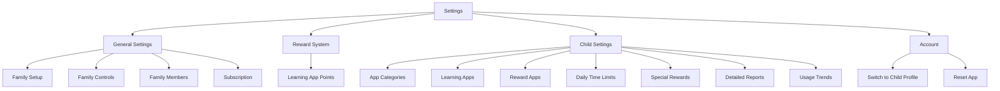
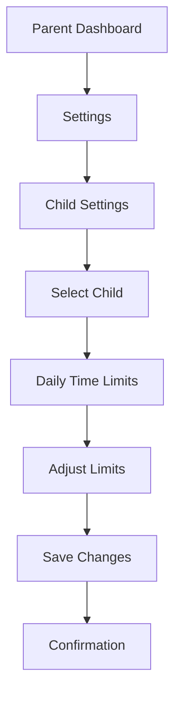
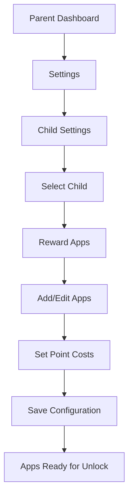

# Screen Time Rewards - Settings UI/UX Specification

This document defines the user experience goals, information architecture, user flows, and visual design specifications specifically for the Settings section of the Screen Time Rewards application. It builds upon the overall UI/UX specification and provides detailed guidance for the Settings implementation.

## Change Log

| Date | Version | Description | Author |
|------|---------|-------------|--------|
| 2025-10-03 | 1.0 | Initial document creation | Sally (UX Expert) |

## 1. Introduction

### 1.1 Overall UX Goals & Principles for Settings

#### Target User Personas (Settings Context)

1. **Parent User:**
   - Needs to configure and manage family screen time policies
   - Requires clear organization of numerous settings options
   - Values efficiency when making frequent adjustments
   - Needs to understand the impact of settings changes on children

#### Usability Goals for Settings

1. **Findability:** Parents can quickly locate specific settings without scrolling through unrelated options
2. **Clarity:** Each setting's purpose and impact is clearly explained
3. **Safety:** Changes that could negatively impact children require confirmation
4. **Efficiency:** Common adjustments can be made with minimal steps
5. **Consistency:** Settings follow predictable patterns throughout the app

#### Design Principles for Settings

1. **Logical Grouping** - Related settings are grouped together with clear section headers
2. **Progressive Disclosure** - Advanced options are hidden until needed
3. **Immediate Feedback** - Settings changes show clear confirmation
4. **Reversible Actions** - Settings can be easily reverted when possible
5. **Contextual Help** - Explanations are available when needed

## 2. Information Architecture (IA) for Settings

### 2.1 Settings Structure

### 2.2 Navigation Structure for Settings

**Primary Navigation:** Settings accessed through main Parent Dashboard tab

**Secondary Navigation:** Hierarchical organization with clear section headers

**Breadcrumb Strategy:** Back button navigation with section context

## 3. User Flows for Settings

### 3.1 Configuring Child Time Limits

**User Goal:** Parent wants to set daily time limits for a specific child's app usage

**Entry Points:** Parent Dashboard > Settings > Child Settings > Daily Time Limits

**Success Criteria:** Time limits are saved and enforced for the selected child

**Edge Cases & Error Handling:**
- No children in family sharing
- Invalid time limit values
- Conflicting settings with bedtime schedules

**Notes:** Should show immediate preview of how limits affect child's daily schedule

### 3.2 Setting Up Reward Apps

**User Goal:** Parent wants to configure which apps require points to unlock and their costs

**Entry Points:** Parent Dashboard > Settings > Child Settings > Reward Apps

**Success Criteria:** Entertainment apps are properly configured with point costs

**Edge Cases & Error Handling:**
- No entertainment apps detected on child's device
- Invalid point costs (negative or zero values)
- Duplicate app configurations

**Notes:** Should provide clear examples of point cost implications

## 4. Wireframes & Mockups for Settings

### 4.1 Design Files

**Primary Design Files:** Figma files to be created for each key settings screen

### 4.2 Key Settings Screen Layouts

#### Main Settings Screen

**Purpose:** Central hub for all settings categories with clear organization

**Key Elements:**
- Section headers for General Settings, Reward System, Child Settings, Account
- Visual indicators for sections with child-specific configurations
- Search functionality for quickly finding specific settings
- "Last updated" timestamps for frequently changed settings

**Interaction Notes:** Sections should be expandable/collapsible for better organization

#### Child-Specific Settings Screen

**Purpose:** Interface for configuring settings that apply to individual children

**Key Elements:**
- Child selector at top of screen
- Category tabs or sections for different setting types
- Visual indicators showing which settings are configured
- Quick action buttons for common adjustments

**Interaction Notes:** Child selection should persist when navigating between setting categories

#### Time Limits Configuration Screen

**Purpose:** Interface for setting daily time limits for different app categories

**Key Elements:**
- Visual breakdown of total daily time allocation
- Category-specific limit controls (Educational, Entertainment, Social, Gaming)
- Weekend vs. weekday limit differentiation
- Downtime scheduling controls
- Break reminder configuration

**Interaction Notes:** Should show immediate impact of limit changes on daily schedule visualization

## 5. Component Library for Settings

### 5.1 Design System Approach

**Design System Approach:** Custom design system based on Apple's Human Interface Guidelines with custom branding for Screen Time Rewards

### 5.2 Core Components for Settings

#### Settings Group Component

**Purpose:** Organize related settings within collapsible sections

**Variants:** Default, expanded, with description

**States:** Collapsed, expanded, disabled

**Usage Guidelines:** Use for logical grouping of 3+ related settings

#### Child Selector Component

**Purpose:** Allow parents to choose which child's settings to configure

**Variants:** Single child, multiple children, with status indicators

**States:** Default, loading, error

**Usage Guidelines:** Place at top of child-specific settings screens

#### Numeric Input with Slider Component

**Purpose:** Allow precise numeric input with visual feedback for time limits and point costs

**Variants:** Time-based (minutes), point-based (whole numbers)

**States:** Default, editing, disabled

**Usage Guidelines:** Include both slider and direct input for accessibility

#### Toggle with Confirmation Component

**Purpose:** For settings that significantly impact child experience

**Variants:** Simple toggle, toggle with modal confirmation

**States:** On, off, confirming

**Usage Guidelines:** Use confirmation for settings that immediately affect children

## 6. Branding & Style Guide for Settings

### 6.1 Visual Identity

**Brand Guidelines:** Family-friendly, positive reinforcement focused brand with emphasis on growth and achievement

### 6.2 Color Palette for Settings

| Color Type | Hex Code | Usage |
|------------|----------|-------|
| Primary | #4A90E2 | Main actions, navigation |
| Secondary | #50C878 | Success states, positive actions |
| Accent | #FFD700 | Rewards, highlights |
| Success | #32CD32 | Confirmation messages |
| Warning | #FFA500 | Caution messages |
| Error | #FF6347 | Error states, destructive actions |
| Neutral | #F5F5F5, #333333 | Backgrounds, text |
| Settings Section | #E6F7FF | Section backgrounds |
| Child Highlight | #E8F5E9 | Child-specific sections |

### 6.3 Typography for Settings

#### Font Families
- **Primary:** SF Pro (system font for iOS)
- **Secondary:** SF Pro Rounded (for child-friendly elements)
- **Monospace:** SF Mono (for technical information)

#### Type Scale for Settings

| Element | Size | Weight | Line Height |
|---------|------|--------|-------------|
| Section Header | 20px | SemiBold | 26px |
| Setting Title | 18px | Medium | 24px |
| Setting Description | 16px | Regular | 22px |
| Input Value | 16px | Medium | 22px |
| Helper Text | 14px | Regular | 20px |

### 6.4 Iconography for Settings

**Icon Library:** SF Symbols (system icons for iOS)

**Usage Guidelines:** 
- Use filled variants for active states, outlined for inactive
- Maintain consistent sizing (title3 for main icons)
- Use color to indicate setting status (green for enabled, gray for disabled)

### 6.5 Spacing & Layout for Settings

**Grid System:** 8px base grid system

**Spacing Scale:** 4px, 8px, 16px, 24px, 32px, 48px, 64px

**Layout Guidelines:**
- 16px padding around settings groups
- 8px spacing between related settings
- 24px spacing between unrelated settings groups
- 12px spacing between setting title and control

## 7. Accessibility Requirements for Settings

### 7.1 Compliance Target

**Standard:** WCAG 2.1 AA with additional considerations for children's apps

### 7.2 Key Requirements for Settings

**Visual:**
- Color contrast ratios: Minimum 4.5:1 for normal text, 3:1 for large text
- Focus indicators: Visible focus rings for all interactive elements
- Text sizing: Support for Dynamic Type with 7 text size options
- Clear visual hierarchy with appropriate heading levels

**Interaction:**
- Keyboard navigation: Full keyboard access to all settings
- Screen reader support: Proper labeling and descriptions for VoiceOver
- Touch targets: Minimum 44x44 points for interactive elements
- Alternative input methods: Support for switch control and other assistive technologies

**Content:**
- Alternative text: Descriptive alt text for all informative images
- Heading structure: Logical heading hierarchy for screen reader navigation
- Form labels: Clear, associated labels for all form controls
- Help text: Concise explanations for complex settings

### 7.3 Testing Strategy for Settings

Regular testing with VoiceOver, Dynamic Type, and Accessibility Inspector. Include users with disabilities in usability testing when possible.

## 8. Responsiveness Strategy for Settings

### 8.1 Breakpoints

| Breakpoint | Min Width | Max Width | Target Devices |
|------------|-----------|-----------|----------------|
| Mobile | 320px | 767px | iPhones |
| Tablet | 768px | 1023px | iPads |
| Desktop | 1024px | - | iPad Pro (landscape) |

### 8.2 Adaptation Patterns for Settings

**Layout Changes:** 
- Mobile: Single column with full-width settings groups
- Tablet/Desktop: Two-column layout for wide settings screens
- Form controls adapt to available width

**Navigation Changes:** 
- Mobile: Back button navigation with clear section titles
- Tablet/Desktop: Sidebar navigation for top-level settings categories

**Content Priority:** 
- Core settings always visible
- Advanced options in expandable sections
- Child selector prominent on child-specific screens

## 9. Animation & Micro-interactions for Settings

### 9.1 Motion Principles for Settings

Animations should be subtle but provide clear feedback, with durations between 200-300ms. Use standard iOS easing curves.

### 9.2 Key Animations for Settings

- **Section Expansion:** Smooth reveal of settings groups (Duration: 250ms, Easing: easeInOut)
- **Setting Change Confirmation:** Subtle highlight when settings are saved (Duration: 300ms, Easing: easeOut)
- **Child Selection Transition:** Smooth transition when switching between children (Duration: 200ms, Easing: easeInOut)
- **Navigation Transition:** Standard iOS navigation transitions between settings screens

## 10. Performance Considerations for Settings

### 10.1 Performance Goals for Settings

- **Page Load:** <1 second for settings views
- **Interaction Response:** <100ms for UI interactions
- **Save Operations:** <500ms for settings save operations
- **Animation FPS:** Maintain 60fps for all animations

### 10.2 Design Strategies for Settings Performance

- Lazy load child-specific settings data
- Cache frequently accessed settings
- Show immediate visual feedback for setting changes
- Use proper loading states for data-dependent settings
- Optimize images and assets for different screen densities

## 11. Next Steps for Settings Implementation

### 11.1 Immediate Actions

1. Review this specification with the development team
2. Create detailed visual designs in Figma for key settings screens
3. Develop a component library based on these specifications
4. Conduct usability testing with parent users

### 11.2 Design Handoff Checklist

- [ ] All settings user flows documented
- [ ] Component inventory complete
- [ ] Accessibility requirements defined
- [ ] Responsive strategy clear
- [ ] Brand guidelines incorporated
- [ ] Performance goals established
- [ ] Edge cases and error handling specified